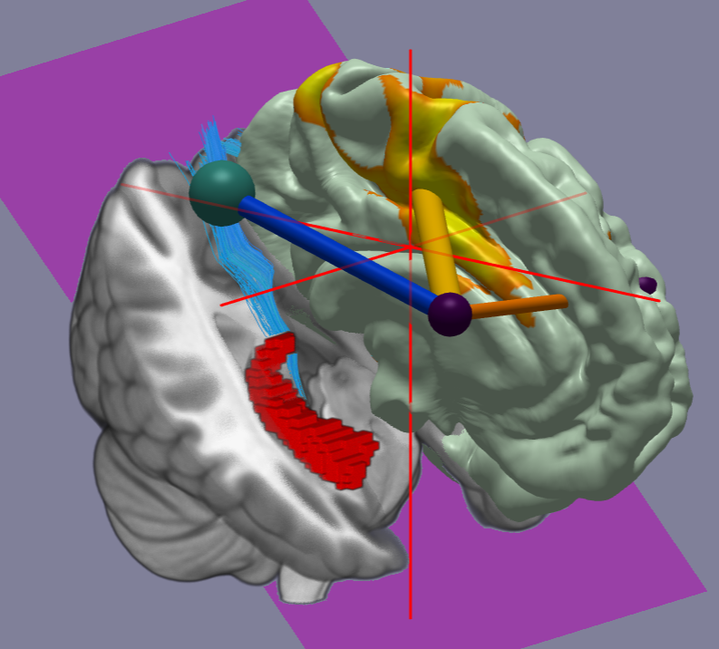

## Introduction

NiiVue can simultaneously show voxels and meshes. It can view three different classes of meshes: triangulated meshes, connecotmes and streamlines. These different classes have different properties and are stored in different formats. This page describes these classes.

The image above is from a NiiVue [live demo](https://niivue.github.io/niivue/features/clipplanes.html). It shows a grayscale voxel-based image with a red voxel-based overlay. It also shows all three classes of meshes: the green cortical surface is a `triangulated mesh`, with a statistical overlay shown in orange. The ball and stick `connectome` is also visible. Finally, a blue `streamline` tract is visible. These three classes are illustrated in the figure below

##### Triangulated Meshes

 - Triangulated meshes are based on vertex locations as well as indices that group the vertices into discrete triangles. Vertices are often reused by multiple triangles: in the figure above `v1` and `v2` are each used by two triangles.
 - NiiVue never adjusts the position of triangulated mesh vertices.
 - The winding order of the indices discriminates the front from the back face. Therefore, the front face of the triangle `0,1,2` is the back face for `0,2,1`. NiiVue assumes a [counter clockwise winding order](https://learnwebgl.brown37.net/model_data/model_volume.html#:~:text=The%20order%20of%20a%20triangle's,is%20called%20the%20winding%20order.).
 - Triangulated mesh color can be influenced by overlays, which specify the scalar intensity (e.g. statistical map) or red/green/blue color of each vertex. The [NiiVue mesh atlas live demo](https://niivue.github.io/niivue/features/mesh.atlas.html) allows the user to interactively adjust the transparency of two overlays on a single mesh: an atlas as well as a statistical map. 
 - Supported mesh-based formats: [GIfTI](https://www.nitrc.org/projects/gifti/), [ASC](http://www.grahamwideman.com/gw/brain/fs/surfacefileformats.htm), [BYU/GEO/G](http://www.grahamwideman.com/gw/brain/fs/surfacefileformats.htm), [BrainSuite DFS](http://brainsuite.org/formats/dfs/), [ICO/TRI](http://www.grahamwideman.com/gw/brain/fs/surfacefileformats.htm), [PLY](<https://en.wikipedia.org/wiki/PLY_(file_format)>), [BrainNet NV](https://www.nitrc.org/projects/bnv/), [BrainVoyager SRF](https://support.brainvoyager.com/brainvoyager/automation-development/84-file-formats/344-users-guide-2-3-the-format-of-srf-files), [FreeSurfer](http://www.grahamwideman.com/gw/brain/fs/surfacefileformats.htm), [MZ3](https://github.com/neurolabusc/surf-ice/tree/master/mz3), [OFF](<https://en.wikipedia.org/wiki/OFF_(file_format)>), [Wavefront OBJ](https://brainder.org/tag/obj/), [STL](https://medium.com/3d-printing-stories/why-stl-format-is-bad-fea9ecf5e45), [Legacy VTK](https://vtk.org/wp-content/uploads/2015/04/file-formats.pdf), [X3D](https://3dprint.nih.gov/).
 - Supported mesh overlay formats: [GIfTI](https://www.nitrc.org/projects/gifti/), [CIfTI-2](https://balsa.wustl.edu/about/fileTypes), [MZ3](https://github.com/neurolabusc/surf-ice/tree/master/mz3), [SMP](https://support.brainvoyager.com/brainvoyager/automation-development/84-file-formats/40-the-format-of-smp-files), STC, FreeSurfer (CURV/ANNOT).

##### Connectomes

 - Connectomes are ball and stick figures that represent nodes (spheres) and the edges (cylinders) that connect them.
 - NiiVue extrudes the node location and edge weights to triangulated spheres and cylinders - the diameter of these structures can interactively adjusted. The sliders for the [connectome live demo](https://niivue.github.io/niivue/features/connectome.html) demonstrates how NiiVue will dynamically scale these features.
 - The color and size of connectome nodes and edges can be based on scalar values, for example statistical test scores. In the image above, the edge color is determined by edge strength, and node color by overlay color. Note the edge strength is shown as a matrix that maps the link weight between each node and all others using the [upper triangle](https://www.geeksforgeeks.org/triangular-matrix/).
 - The [pointset](https://niivue.github.io/niivue/features/pointset.html) live demo shows how connectome features can be added and removed.
 - NiiVue uses a simple JSON format to represent connectomes.
 
##### Streamlines

 - Streamlines are used for tractography data.
 - Streamlines can either be drawn as single-pixel lines, or extruded to triangulated cylinders. The `radius` slider of the [tract live demo](https://niivue.github.io/niivue/features/tracts.cylinder.html) shows how NiiVue dynamically scales the diameter.
 - Each vertex of a streamline can be assigned a color based on the global direction, local direction, group, per-vertex or per-streamline properties. The [tract group live demo](https://niivue.github.io/niivue/features/tracts.group.html) showcases these properties.
 - The TrackVis TRK format is popular. However, it uses voxel corner to specifiy coordinates, rather that the typical voxel center or world space coordinates. While nibabel, Surfice and NiiVue follow this convention, be aware that other tools (included DSI Studio) use voxel centers. This means that TRK files created by one tool can appear shifted by half a voxel in other tools. A [validation dataset](https://github.com/neurolabusc/TRK) is available.
 - Supported streamline-based formats: [TCK](https://mrtrix.readthedocs.io/en/latest/getting_started/image_data.html#tracks-file-format-tck), [TRK](http://trackvis.org/docs/?subsect=fileformat), [TRX](https://github.com/frheault/tractography_file_format), [TT](https://dsi-studio.labsolver.org/doc/cli_data.html), VTK, AFNI .niml.tract
 - Overlay properties are commonly embedded inside TRX and TRK format streamlines, but can also be loaded from separate [TSF](https://mrtrix.readthedocs.io/en/dev/getting_started/image_data.html#track-scalar-file-format-tsf) files.